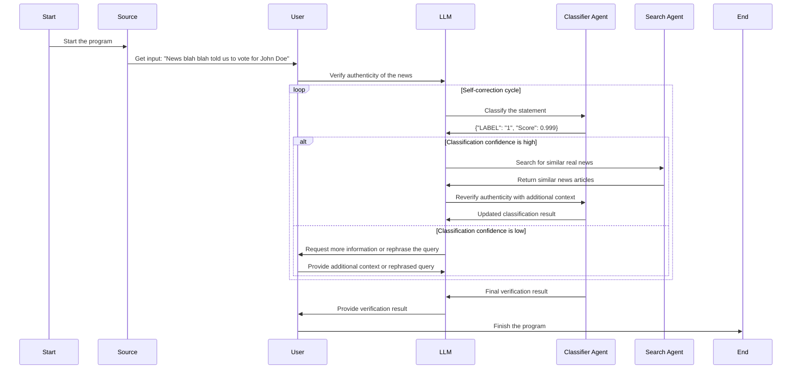

## System Diagram

```mermaid
sequenceDiagram
   participant S as Start
   participant SRC as Source
   participant U as User
   participant L as LLM
   participant A1 as Classifier Agent
   participant A2 as Search Agent
   participant ED as End


   S->>SRC: Start the program
   SRC->>U: Get input: "News blah blah told us to vote for John Doe"
   U->>L: Verify authenticity of the news
   loop Self-correction cycle
       L->>A1: Classify the statement
       A1->>L: {"LABEL": "1", "Score": 0.999}
       alt Classification confidence is high
           L->>A2: Search for similar real news
           A2->>L: Return similar news articles
           L->>A1: Reverify authenticity with additional context
           A1->>L: Updated classification result
       else Classification confidence is low
           L->>U: Request more information or rephrase the query
           U->>L: Provide additional context or rephrased query
       end
   end
   A1->>L: Final verification result
   L->>U: Provide verification result
   U->>ED: Finish the program
```
