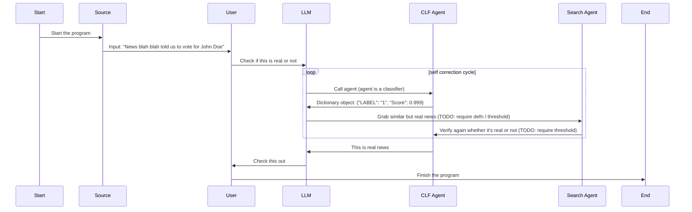

## System Diagram

```mermaid
sequenceDiagram

    participant S as Start
    participant SRC as Source
    participant U as User
    participant L as LLM
    participant A1 as CLF Agent
    participant A2 as Search Agent
    participant ED as End

    S->>SRC: Start the program
    SRC->>U: Input: "News blah blah told us to vote for John Doe"
    U->>L: Check if this is real or not
    loop self correction cycle
        L->>A1: Call agent (agent is a classifier)
        A1->>L: Dictionary object: {"LABEL": "1", "Score": 0.999}
        L->>A2: Grab similar but real news (TODO: require defn / threshold)
        A2->>A1: Verify again whether it's real or not (TODO: require threshold)
    end
    A1->>L: This is real news
    L->>U: Check this out
    U->>ED: Finish the program

```
