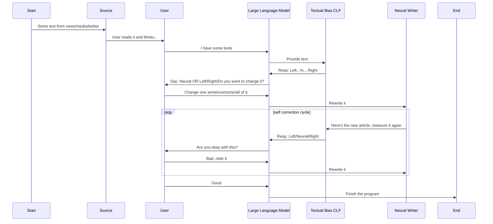

## Sequence Diagram for Textual Correction of Political Bias

```mermaid
sequenceDiagram

    participant S as Start
    participant SRC as Source
    participant U as User
    participant L as Large Language Model
    participant A1 as Textual Bias CLF
    participant A2 as Neural Writer
    participant ED as End

    S->>SRC: Some text from news/media/twitter
    SRC->>U: User reads it and thinks...
    U->>L: I have some texts
    L->>A1: Provide text
    A1->>L: Resp: Left...%....Right
    L->>U: Say: Neural OR Left/Right/Do you want to change it?
    U->>L: Change one sentence/some/all of it.
    L->>A2: Rewrite it

    loop self correction cycle
        A2->>A1: Here's the new article, measure it again
        A1->>L: Resp: Left/Neural/Right
        L->>U: Are you okay with this?
        U->>L: Bad, redo it
        L->>A2: Rewrite it
    end

    U->>L: Good
    L->>ED: Finish the program
```
