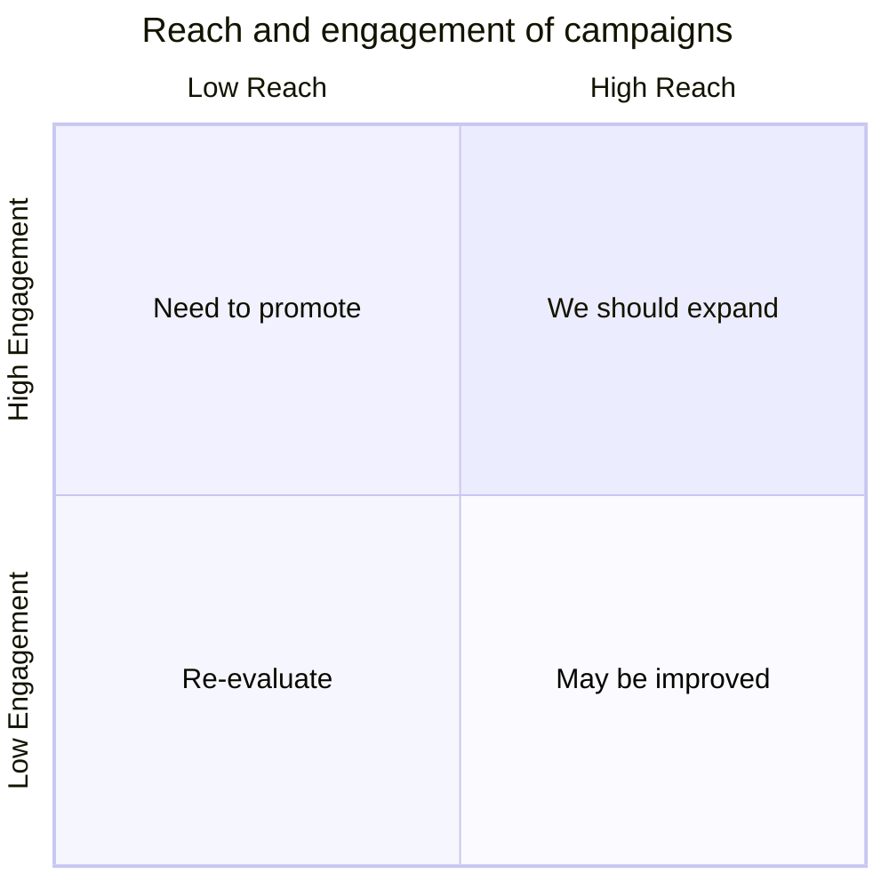
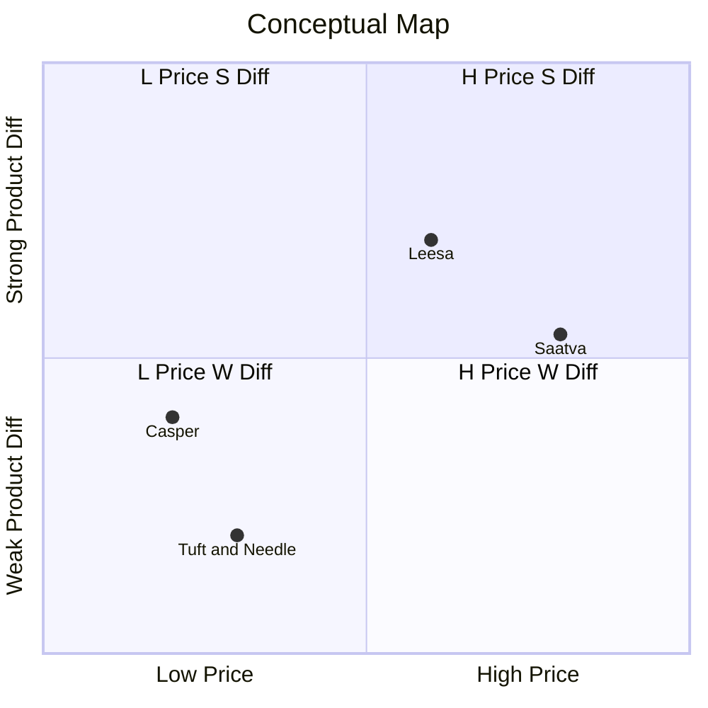

## An example of Quadrant Diagram

```mermaid
quadrantChart
    title Reach and engagement of campaigns
    x-axis Low Reach --> High Reach
    y-axis Low Engagement --> High Engagement
    quadrant-1 We should expand
    quadrant-2 Need to promote
    quadrant-3 Re-evaluate
    quadrant-4 May be improved


```

```mermaid
quadrantChart
    title Conceptual Map
    x-axis Low Price --> High Price
    y-axis Weak Product Diff --> Strong Product Diff
    quadrant-1 H Price S Diff
    quadrant-2 L Price S Diff
    quadrant-3 L Price W Diff
    quadrant-4 H Price W Diff
    Saatva:          [0.8, 0.54]
    Leesa:           [0.6, 0.7]
    Tuft and Needle: [0.3, 0.2]
    Casper:          [0.2, 0.4]

```
