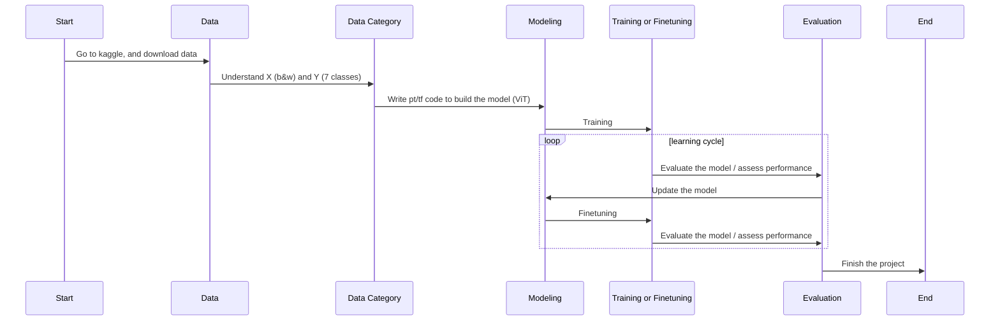

## How to 

begin: data science | data engineer / data pipeline
medium: ml engineer | ml modeling
high: tech lead | architect solution (do it)
higher/manager: senior manager / principle level (tech/dev) / solution architect  | draw diagram

