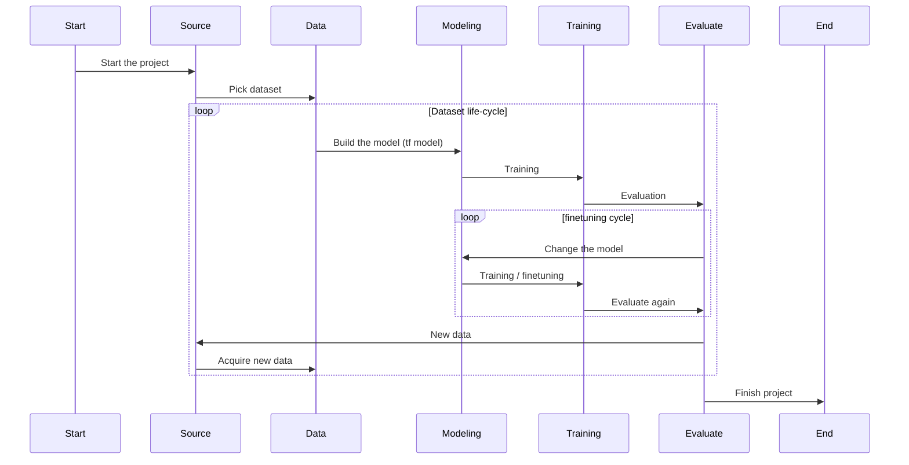

## System Diagram: How to train an image classifier?

```mermaid
sequenceDiagram

  participant S as Start
  participant SRC as Source
  participant DTA as Data
  participant MOD as Modeling
  participant TR as Training
  participant EV as Evaluate
  participant ED as End

  S->>SRC: Start the project
  SRC->>DTA: Pick dataset
  loop Dataset life-cycle
    DTA->>MOD: Build the model (tf model)
    MOD->>TR: Training
    TR->>EV: Evaluation
  
    loop finetuning cycle
      EV->>MOD: Change the model
      MOD->>TR: Training / finetuning
      TR->>EV: Evaluate again
    end

  EV->>SRC: New data
  SRC->>DTA: Acquire new data
    
  end

  EV->>ED: Finish project
  

```
