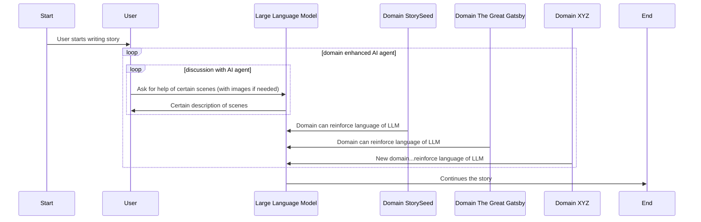

## Sequence Diagram

```mermaid
sequenceDiagram

  participant S as Start
  participant U as User
  participant L as Large Language Model
  participant DOM1 as Domain StorySeed
  participant DOM2 as Domain The Great Gatsby
  participant DOM3 as Domain XYZ
  participant ED as End

  S->>U: User starts writing story

  loop domain enhanced AI agent
    loop discussion with AI agent
      U->>L: Ask for help of certain scenes (with images if needed)
      L->>U: Certain description of scenes
    end
  
    DOM1->>L: Domain can reinforce language of LLM
    DOM2->>L: Domain can reinforce language of LLM
    DOM3->>L: New domain...reinforce language of LLM

  end

  L->>ED: Continues the story
```
